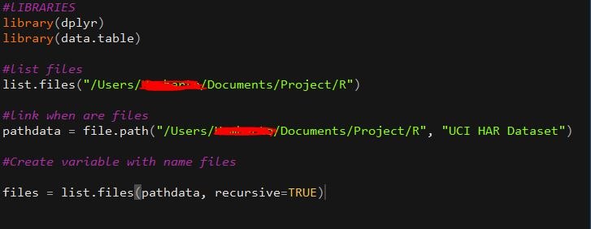
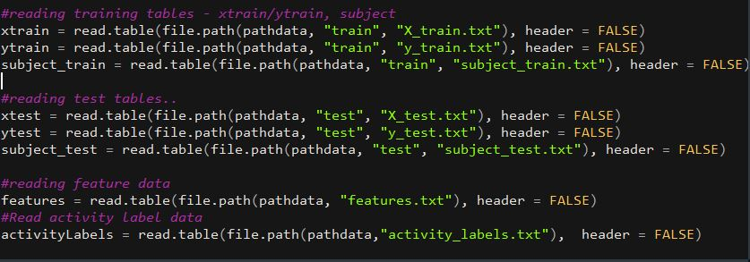
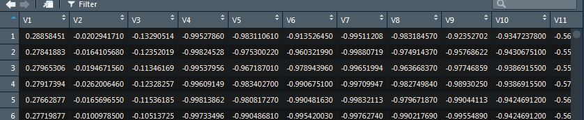
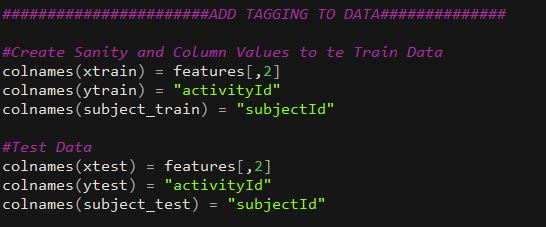
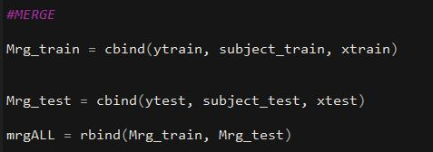
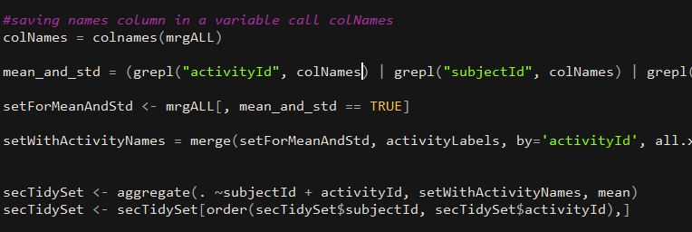
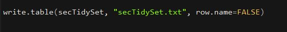

git## Assignment.R

<h1>Orientation</h1>

The purpose of this project is to demonstrate your ability to collect, work with, and clean a data set. The goal is to prepare tidy data that can be used for later analysis. You will be graded by your peers on a series of yes/no questions related to the project. You will be required to submit: 1) a tidy data set as described below, 2) a link to a Github repository with your script for performing the analysis, and 3) a code book that describes the variables, the data, and any transformations or work that you performed to clean up the data called CodeBook.md. You should also include a README.md in the repo with your scripts. This repo explains how all of the scripts work and how they are connected.

One of the most exciting areas in all of data science right now is wearable computing - see for example this article . Companies like Fitbit, Nike, and Jawbone Up are racing to develop the most advanced algorithms to attract new users. The data linked to from the course website represent data collected from the accelerometers from the Samsung Galaxy S smartphone. A full description is available at the site where the data was obtained:

http://archive.ics.uci.edu/ml/datasets/Human+Activity+Recognition+Using+Smartphones

<h3>Here are the data for the project:</h3>

https://d396qusza40orc.cloudfront.net/getdata%2Fprojectfiles%2FUCI%20HAR%20Dataset.zip

# STEPS

 Became prepared to libraries that we will need duranting process.
this libraies are 'dplyr' and 'data.table', althought we became dowloand files to make assignment

 There are three core variables:

Main
2. Test 3. Train
Main : activity_labels Inertial Signals Inertial Signals Test: features subject_test subject_train Train: features.info X_test X_train

README y_test y_train 'features_info.txt': Shows information about the variables used on the feature vector.
 - 'features.txt': List of all features. 
 - 'activity_labels.txt': Links the class labels with their activity name. * - 'train/X_train.txt': Training set. 
 - 'train/y_train.txt': Training labels. 
 - 'test/X_test.txt': Test set. 
- 'test/y_test.txt': Test labels

Analysis shows that you can categorize the data into 4 segments 
 - training set 
 - test set 
 - features 
 - activity labels

Inertial Signal data is not required. Additionally, features and activity label are more for tagging and descriptive than data sets.

The objective here is to make the test and training data as per the sequence stated above. 4 basic level data sets will be defined and created:

<ol>
- test data set
- train data set
- features data set
- activity labels data set</ol>

<cite> - the issue here is that the columns are not tagged and there is no easy way to interpret the data. This is a major issue with all data sets.And some coders do it later on however I believe that the best part is to create teh tagging now and create a proper data set now.</cite>

<h3>Tagging the test and train data sets now </h3>

<h3>The main objective was to merge the test and train data - Here are the R STEPS to ensure</h3>

<h3>Extracting only the measurements on the mean and standard deviation for each measurement</h3>

Here the understanding is to measure the mean and standard deviation values only. This can be possible through different means. Here we are using the grepl function to get the data and create a data set associated with the requirements.

creates a independent tidy data set with the average of each variable for each activity and each subject

New tidy set has to be created

This is a tricky area and you need to first of all get the average of each variable for each activity. 

A good fuction here that can be used is the aggregate function

